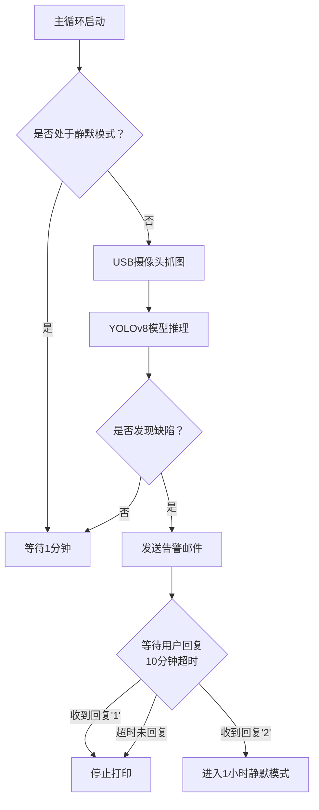

# 3D打印缺陷智能检测与交互式处理系统

[](https://www.python.org/)
[](https://opencv.org/)
[](https://pytorch.org/)
[](https://github.com/ultralytics/yolov8)

## 项目简介

本项目是一个部署在3D打印机上位机（如树莓派）上的智能监控系统。它利用 **YOLOv8** 深度学习模型，周期性地对打印过程进行视觉检测。一旦识别到打印缺陷，系统会通过邮件向用户告警，并根据用户的邮件回复或超时机制，自动执行相应的控制命令（停止打印或进入静默期），有效减少材料浪费和时间损失。

## 核心功能

- **⏰ 定时监控**：每分钟自动捕获一次打印画面。
- **🔍 缺陷识别**：基于YOLOv8模型，精准检测多种常见3D打印缺陷（如翘边、拉丝、层错位等）。
- **📧 邮件交互**：发现缺陷后，自动发送包含操作指引的告警邮件。
- **👤 人工决策**：用户可通过回复邮件内容（“1”或“2”）来决策下一步行动。
- **🤖 自动执行**：根据用户指令或超时规则，自动调用OctoPrint API控制打印机。
- **🔕 静默模式**：用户可指令系统在指定时间内暂停告警。

## 系统架构与工作流程



## 技术栈

- **编程语言**: Python 3
- **深度学习框架**: PyTorch, YOLOv8
- **计算机视觉库**: OpenCV
- **邮件协议**: SMTP (发件), IMAP (收件)
- **控制API**: OctoPrint REST API

## 快速开始

### 环境要求

- 硬件：运行OctoPrint的上位机（如树莓派4B）、USB摄像头
- 操作系统: Ubuntu / Debian

### 安装与部署

1. **克隆项目**
   ```bash
   git clone https://github.com/your-username/your-repo-name.git
   cd your-repo-name
   ```

2. **安装Python依赖**
   ```bash
   pip install -r requirements.txt
   ```
   核心依赖包括：`opencv-python`, `torch`, `ultralytics`, `requests`

2. **配置系统参数**
   复制并重命名 `config.example.json` 为 `config.json`，并填入您的配置：
   ```json
   {
     "smtp_server": "smtp.gmail.com",
     "smtp_port": 587,
     "email_address": "your_email@gmail.com",
     "email_password": "your_app_password",
     "octoprint_api_key": "your_octoprint_api_key_here",
     "octoprint_url": "http://localhost:5000"
   }
   ```

3. **配置系统服务 (用于后台运行)**
   ```bash
   # 将服务文件复制到系统目录
   sudo cp systemd/print_defect_monitor.service /etc/systemd/system/
 
   # 重载systemd配置
   sudo systemctl daemon-reload
 
   # 启用并启动服务
   sudo systemctl enable print_defect_monitor.service
   sudo systemctl start print_defect_monitor.service
   ```

## 使用方法

1. **启动系统**: 服务将在后台自动运行。
2. **正常打印**: 系统每分钟自动检测一次，无异常时不打扰。
3. **接收告警**: 当缺陷发生时，您会收到一封类似以下的邮件：
   ```
   主题： 【3D打印告警】检测到打印缺陷！

   正文：
   在您的打印任务中检测到疑似 [翘边] 缺陷。
   请回复本邮件，输入以下数字进行操作：
   1 - 立即停止打印
   2 - 忽略此次告警，1小时内不再提醒

   【系统提示】如果您在10分钟内未回复，打印将自动停止。
   ```

4. **回复邮件决策**:
   - 回复 `1`: 系统立即停止当前打印任务。
   - 回复 `2`: 系统进入1小时静默模式，此间不再发送告警。

## 项目目录结构

```
3D-Print-Defect-Detection/
├── README.md
├── requirements.txt
├── config.json
├── main.py                 # 主程序入口
├── src/
│   ├── camera.py           # 摄像头操作模块
│   ├── detector.py          # YOLOv5推理模块
│   ├── mail_client.py       # 邮件收发模块
│   └── octoprint_client.py # API控制模块
├── models/
│   └── best.pt            # 训练好的YOLOv8模型权重
├── systemd/
│   └── print_defect_monitor.service
└── logs/                    # 日志目录
```

## 联系我们

如有问题或建议，请通过以下方式联系：
- 邮箱： geekelement@outlook.com

## 许可证

本项目采用 MIT 许可证 - 详见 [LICENSE](LICENSE) 文件。

---

**注意**：在使用前，请确保您已训练好适用于您打印场景的YOLOv5模型 (`best.pt`)。